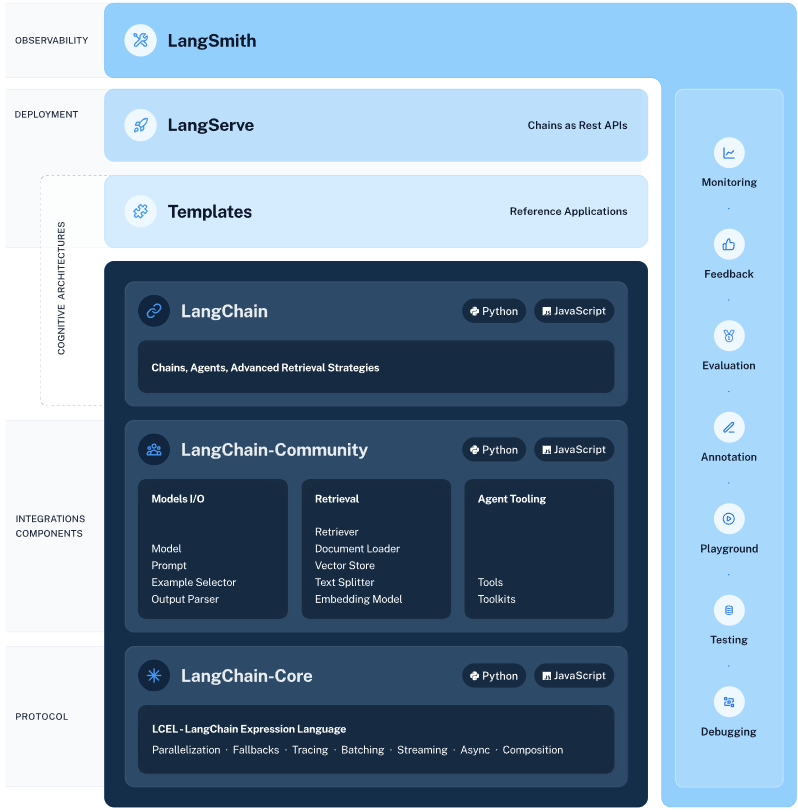
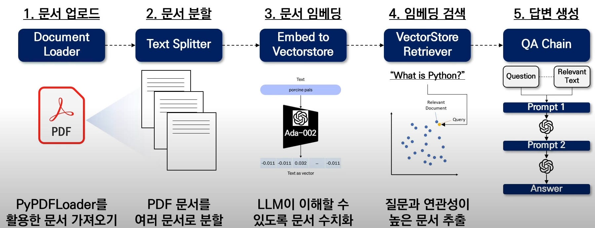

# LangChain
> LLM(대형 언어 모델)을 사용하여 애플리케이션 개발을 단순화 하기 위해서 설계된 프레임워크로 문서 분석, 요약, 챗봇, 코드 분석등에 자주 사용된다.
- 데이터 인식 : 언어 모델은 기존의 학습 데이터외 다른 데이터 소스를 연결하여 새로운 답변을 생성할 수 있다.
- 에이전트 기능 : 언어 모델에 다른 환경을 제공하여 상호 작용이 가능하도록 한다.
- LangSmith : LLM 프레임워크에 구축된 체인을 디버그, 테스트, 평가 및 모니터링하고 LangChain과 원활하게 통합할 수 있는 개발자 플랫폼이다.
- LangServe : LangChain 체인을 REST API로 배포하기 위한 라이브러리이다.
- LangChain Templates : 다양한 작업을 위해 쉽게 배포할 수 있는 참조 아키텍처 모음이다.



## What
> langchain은 아래와 같이 gpt가 가진 문제를 vectorstore, textSplitter, prompt를 제공하여 이를 기반으로 답변할 수 있도록 하여 아래의 문제를 해결할 수 있다.

~~~markdown
issue 1
open ai사의 gpt가 발표되고 우리의 검색 방식은 많은 변화가 생기게 되었다.
그러나 chat gpt는 2021년까지의 데이터가 최신 데이터이며 2022년 이후 정보는 보유하지 않기 때문에 잘못된 답변을 하는 일이 많다는 문제가 있으며 chatgpt에서 입력할 수 있는 데이터에는 제한이 있다. {gtp3.5(4096), gpt-4(8192)}
이외로 GPT는 버전에 따른 성격이 존재하는데 이를 통해 환각 현상이 발생하여 우리에게 거짓말을 하는 경우가 종종 발생하게 된다.

issue 2
application에서 gpt를 사용하다가 llm 모델을 변경해야 하는 경우 애플리케이션의 전반적인 테스트와 소스코드를 수정해야 하는 일이 빈번하게 발생하게 된다. 그러나 langchain의 경우 기존의 설정은 그대로 두고 llm 모델만 변경하면 손쉽게 모델을 변경할 수 있다.

LangChain은 GPT가 가지고 있는 한계점을 극복할 수 있는 방법 중 한 가지로 볼 수 있다.
- Fine-funing : 기존의 gpt가 가지고 있는 정보에 새로운 정보를 학습시켜 원하는 용도의 모델로 업데이트
- N-Shot Learning : 0 ~ n개의 출력 예시를 제시하여 용도에 맞는 출력을 조정함
- In-Context Learing : 문백을 제시하고 해당 문맥을 기반으로 모델이 출력하도록 한다.
~~~

- gpt의 가짜 논문 생성 : https://www.docdocdoc.co.kr/news/articleView.html?idxno=3002349
- gpt를 복붙한 논문 : https://www.asiae.co.kr/article/2023091209440262767


## How?
> 아래의 예시는 웹사이트를 기반으로 챗봇을 구축하는 경우 동작하는 흐름을 보여준다.

1. Document loader : 사이트를 가져오게 되며 위 과정에서 beautiful soup과 같은 lib를 통해 웹 문서의 구조를 파악하고 문서로 읽어온다.
2. Text spliter : 저장된 내용을 여러 문서로 분할한다.
3. Embed : 분할된 내용을 gpt 모델이 이해하기 좋은 형식으로 변경한다(vector).
4. vectorstore : Embed된 내용을 vectorstore에 저장하여 수치화 한다.
5. vectorStoreRetriever : 입력된 데이터에 가장 연관성이 높은 부분에서 답변을 생성한다. (해당 과정은 vector의 개념이 필요함)
6. prompt : 답변을 위한 예시를 지정한다.
7. chain : 모델, 문서, 질문을 하나의 체인으로 생성하여 사용자에 질문에 답변을 할 수 있는 형태로 변경함
8. Answer : 답변 



------

## 환경 설정

### chap01
> 해당 환경은 miniconda가 설치되어 있는 것을 기준으로 정리하며 chap01에서는 ollama를 이용하여 테스트를 진행한다.

[ollama](https://ollama.com/download) : facebook에서 만든 llm 모델이다.(추가 설명 수정)

```
# 가상 환경 만들기
$ conda create -n langChainQuick python

# 가상 환경 사용하기
$ conda activate langChainQuick 

# conda forge에서 langchain lib를 가상 환경에 설치한다.
# 위 설치는 langChain에서 최소 요구 사항이 설치되며 종속성은 설치 되지 않기 때문에 추가 설치를 해줘야 한다.
$ conda install langchain -c conda-forge

# 이후 01_condaWithLangchain.py 스크립트 진행

```

### chap02
> miniconda 및 chap01 수행을 완료한 이후 정리하며 gpt를 이용하여 테스트를 진행한다. 
- gpt store에서 api를 결제하여 사용해야 한다.

```
# chap01에서 설치하지 않았다면 설치한다.
pip intall langchain
# gpt 설치하기 
pip install openai 

# 02_set_key.py에 내용을 실행하여 key를 os의 환경 변수로 설정함

```


